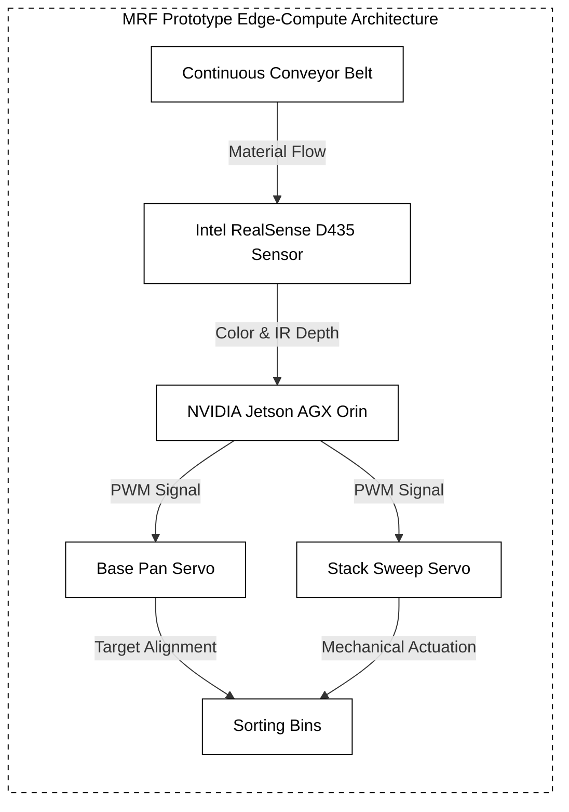
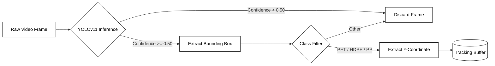
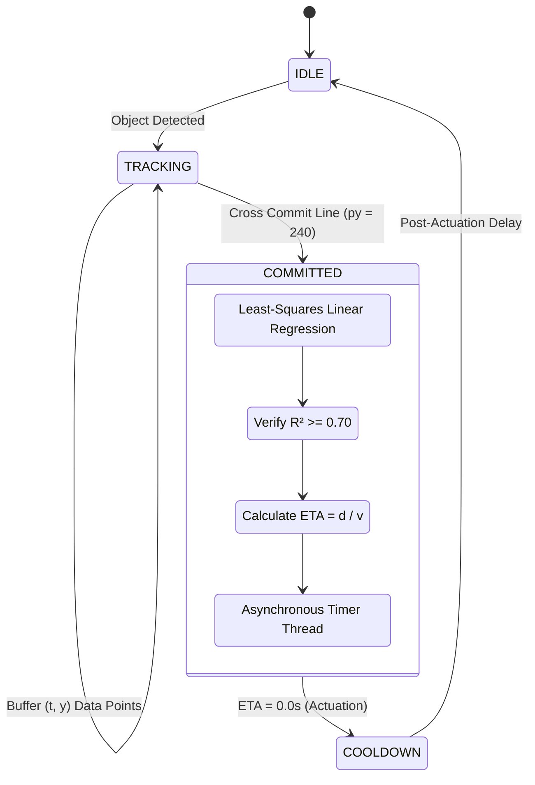
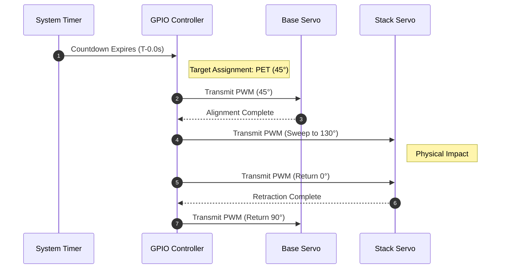
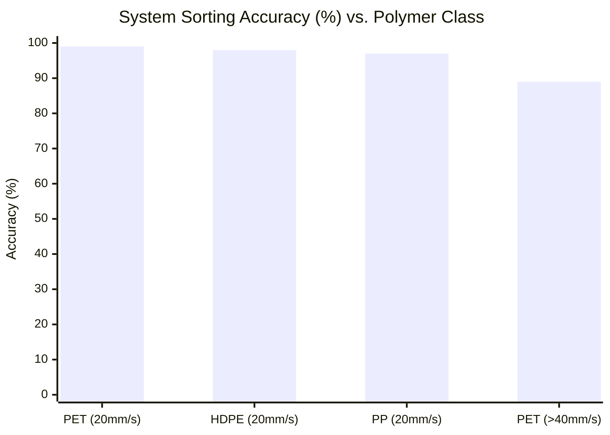

# KRUX: Architecture Diagrams

Below are the Mermaid architecture diagrams detailing the hardware, software, and mechanical logic of the centralized MRF Conveyor system.

### Figure 5: Complete Conveyor Prototype (Architecture Block Diagram)

### Figure 6: YOLO Detection + Tracking Screen (Software Flowchart)

### Figure 7: ETA/Velocity Output (Mathematical State Diagram)

### Figure 8: Servo Sorting Action (Sequence Diagram)

### Figure 9: Performance Graph (Data Chart)

